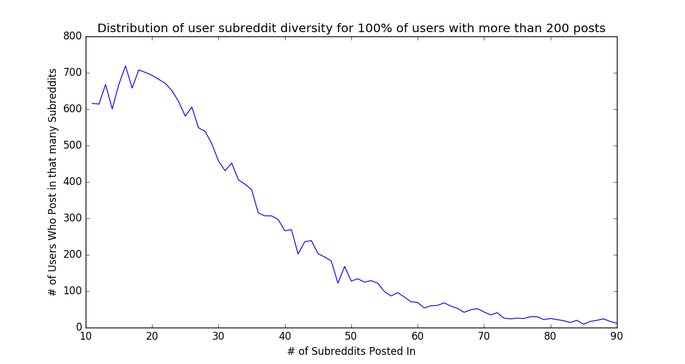

<b>Subreddit diversity of January 2014:</b>

In the web browsing data, the proportion of k-returners is 56.3, 93.9 and 99.8% for k = 2, 4, 8 respectively.

<b>Users who posted in 10 to 20 sub-Reddits:</b>  

Total users: 1982  

2-returners: 1185, 0.597881%  

4-returners: 1827, 0.921796%  

8-returners: 1974, 0.995964%
 
<b>Users who posted in 20 to 30 sub-Reddits:</b>

Total users: 1836

2-returners: 864, 0.470588%

4-returners: 1593, 0.867647%

8-returners: 1820, 0.991285%
 
<b>Users who posted in 30 to 40 sub-Reddits:</b>

Total users: 1101

2-returners: 564, 0.512262%

4-returners: 957, 0.869210%

8-returners: 1087, 0.987284%
 
<b>Users who posted in 40 to 50 sub-Reddits:</b>

Total users: 670

2-returners: 290, 0.432836%

4-returners: 560, 0.835821%

8-returners: 658, 0.982090%
 
<b>Users who posted in 50 to 60 sub-Reddits:</b>

Total users: 321

2-returners: 152, 0.473520%

4-returners: 243, 0.757009%

8-returners: 306, 0.953271%
 
<b>Users who posted in 60 to 70 sub-Reddits:</b>

Total users: 171

2-returners: 69, 0.403509%

4-returners: 124, 0.725146%

8-returners: 160, 0.935673%
 
<b>Users who posted in 70 to 80 sub-Reddits:</b>

Total users: 102

2-returners: 32, 0.313725%

4-returners: 70, 0.686275%

8-returners: 96, 0.941176%
 
<b>Users who posted in 80 to 90 sub-Reddits:</b>

Total users: 54

2-returners: 21, 0.388889%

4-returners: 45, 0.833333%

8-returners: 51, 0.944444%
 
<b>Users who posted in 90 to 100 sub-Reddits:</b>

Total users: 38

2-returners: 17, 0.447368%

4-returners: 29, 0.763158%

8-returners: 38, 1.000000%

<b>Histogram of sk values, where sk is (rg_k / rg), for k=2,4,8:</b>

For comparison, the sk plots for the web mobility data are:

Overall, these plots are quite similar which further reinforces the mobility model hypothesis. I'm considering comparing the two sets of histograms with a two-sample KS test.
